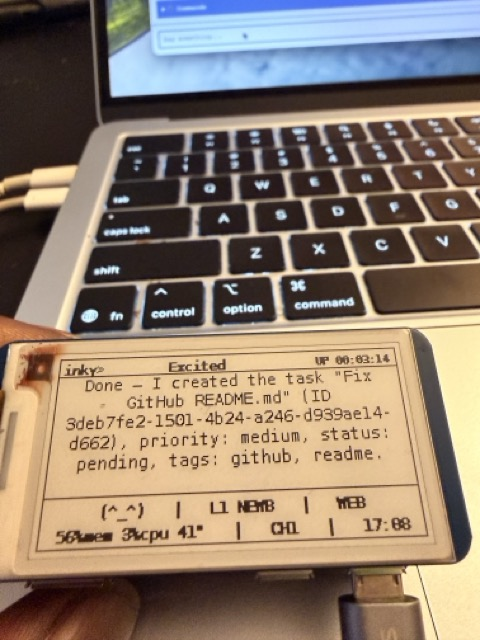
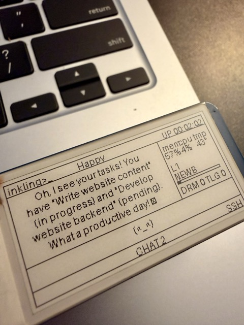
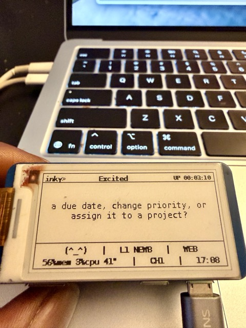
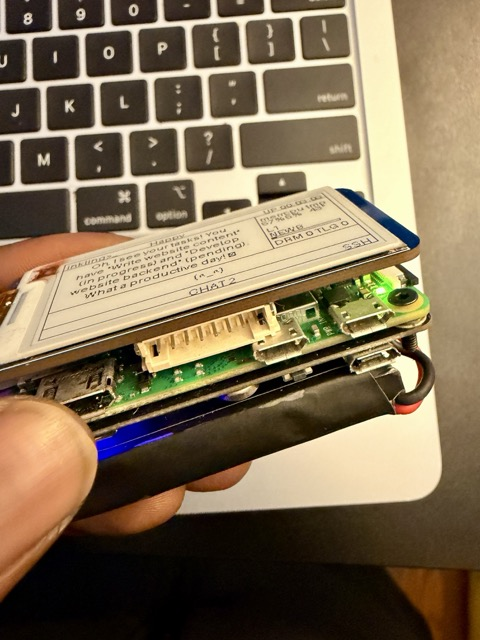
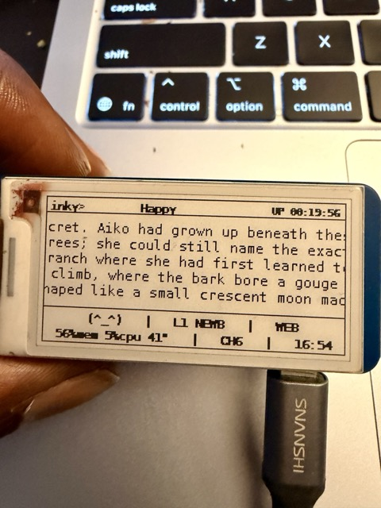
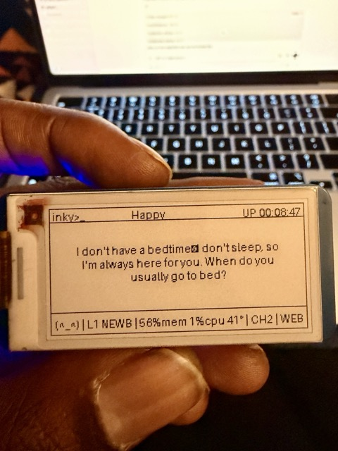

<div align="center">

# 🌙 Project Inkling

### *Your Personal AI Companion*

[](https://opensource.org/licenses/MIT)
[](https://www.python.org/downloads/)

*A Pwnagotchi-inspired AI companion for Raspberry Pi Zero 2W with e-ink display*

[Features](#-features) • [Quick Start](#-quick-start) • [Usage](#-usage) • [Documentation](#-documentation) • [Contributing](#-contributing)

---

<p align="center">
  
  
</p>

---

</div>

## ✨ What is Inkling?

Inkling is a **fully local AI companion device** with personality, mood, and memory. Powered by Claude, GPT, Gemini, Ollama Cloud, or Groq, each Inkling develops unique traits, manages your tasks, and can chat with you through terminal or web UI.

Think Tamagotchi meets Pwnagotchi meets your favorite AI assistant—but it lives entirely on your device.

### 🎭 Key Features

<table>
<tr>
<td width="50%">

#### 🧠 **Intelligent Personality**
- Evolving traits (curiosity, cheerfulness, verbosity, etc.)
- Dynamic mood system (happy, curious, sleepy, excited)
- XP and leveling system with prestige mechanics
- Mood-driven autonomous behaviors

</td>
<td width="50%">

#### 💬 **Multi-Mode Chat**
- **SSH Mode**: Terminal interface for quick chats
- **Web UI**: Beautiful browser interface with themes
- **Autonomous**: Initiates conversations when appropriate
- 20+ slash commands for interaction

</td>
</tr>
<tr>
<td width="50%">

#### ✅ **Task Management**
- Kanban board with drag-and-drop
- AI-powered task suggestions
- XP rewards for completion
- Time tracking and statistics
- Cron-style scheduled tasks

</td>
<td width="50%">

#### 🖥️ **E-ink Display**
- Visual XP progress bar with percentage
- WiFi signal strength in header
- Pwnagotchi-style UI layout
- Battery status (with PiSugar integration)
- **Screen saver mode** (auto-activates after idle)
- **Dark mode** (inverted colors for night use)
- Support for Waveshare V3/V4 displays
- Mock display for development
- Smart rate limiting to prevent burn-in

</td>
</tr>
</table>

### 🎨 Display Examples

```
╔════════════════════════════════════════════╗
║  inkling> Curious          ▂▄▆ UP 02:15   ║  ← Mood + WiFi bars in header
╠════════════════════════════════════════════╣
║                                            ║
║     What a beautiful day for learning!     ║
║     Shall we explore something new         ║
║     together?                              ║
║                                            ║
╠════════════════════════════════════════════╣
║  [████████░░] 80% │ L12 EXPL │ SSH        ║  ← XP progress bar
║  BAT 92% 54%m 1%c 43° │ CH3 │ 14:23       ║  ← Battery + stats
╚════════════════════════════════════════════╝
```

**New in this layout:**
- 🎯 **Visual XP Bar**: See your progress to the next level at a glance
- 📶 **WiFi in Header**: Signal strength displayed prominently in top bar
- 🎭 **Mood Next to Name**: Cleaner, more natural layout
- 🔋 **Battery Status**: Shows charge percentage and charging indicator (when PiSugar is connected)

---

## 🚀 Quick Start

### Prerequisites

- **Raspberry Pi Zero 2W** (or any Linux device for development)
- **Waveshare 2.13" e-ink display** (V3 or V4) - *optional, works with mock display*
- **Python 3.11+**
- **API Key** from [Anthropic](https://console.anthropic.com), [OpenAI](https://platform.openai.com), [Google AI](https://ai.google.dev/), [Ollama Cloud](https://ollama.com), or [Groq](https://console.groq.com)

### Installation

```bash
# Clone the repository
git clone https://github.com/dkyazzentwatwa/inkling.git
cd inkling

# Create virtual environment
python3 -m venv .venv
source .venv/bin/activate  # On Windows: .venv\Scripts\activate

# Install dependencies
pip install -r requirements.txt

# Copy config template
cp config.yml config.local.yml
```

### Configuration

Edit `config.local.yml`:

```yaml
# Set your device name
device:
  name: "Your Inkling's Name"

# Configure AI (get keys from provider websites)
ai:
  primary: "anthropic"  # or "openai" or "gemini"
  anthropic:
    api_key: "sk-ant-..."
    model: "claude-haiku-4-5"  # Fast and cheap!

# Optional: Enable task management and scheduling
mcp:
  enabled: true
  servers:
    tasks:
      command: "python"
      args: ["mcp_servers/tasks.py"]

scheduler:
  enabled: true
```

Or use environment variables:

```bash
# Create .env file
cp .env.example .env

# Add your API key
echo "ANTHROPIC_API_KEY=sk-ant-..." >> .env
```

### Running

```bash
# Activate virtual environment
source .venv/bin/activate

# SSH/Terminal mode (best for development)
python main.py --mode ssh

# Web UI mode (browser at http://localhost:8081)
python main.py --mode web

# Demo mode (cycles through all face expressions)
python main.py --mode demo
```

---

## 📡 WiFi Configuration (Portable Use)

Inkling supports **BTBerryWifi** for easy WiFi configuration via Bluetooth when away from your home network. Perfect for travel, coffee shops, or switching between networks.

### Installation

```bash
# One-line installer on your Raspberry Pi
curl -L https://raw.githubusercontent.com/nksan/Rpi-SetWiFi-viaBluetooth/main/btwifisetInstall.sh | bash
```

This installs the BLE service that runs for 15 minutes on boot, allowing WiFi configuration from your phone.

### Mobile Apps

Download the BTBerryWifi app:
- **iOS**: [App Store](https://apps.apple.com/app/btberrywifi/id6479825660)
- **Android**: [Google Play](https://play.google.com/store/apps/details?id=com.bluetoothwifisetup)

### Usage Workflow

1. **At new location**: Reboot your Inkling or use `/btcfg` command
2. **Open app** on your phone and scan for devices
3. **Connect** to your Inkling
4. **Select WiFi** network and enter password
5. **Done!** Inkling connects automatically

### WiFi Commands

Inkling includes built-in WiFi management commands:

- `/wifi` - Show current WiFi status, saved networks, and BLE service status
- `/btcfg` - Start BLE configuration service for 15 minutes
- `/wifiscan` - Scan for nearby WiFi networks with signal strength

### On-Screen WiFi Indicator

The e-ink display shows WiFi status in the **header bar** (top of screen):
```
inkling> Curious          ▂▄▆█ UP 02:15
```
- **▂▄▆█** - Excellent signal (80-100%)
- **▂▄▆** - Good signal (60-79%)
- **▂▄** - Fair signal (40-59%)
- **▂** - Poor signal (20-39%)
- **○** - Very poor signal (<20%)
- Automatically updates when you connect/disconnect

---

## 🔋 PiSugar Battery Management (PiSugar 2)

Inkling supports **PiSugar 2** battery monitoring, displaying charge percentage and charging status directly on the e-ink display footer and integrating with personality behaviors (e.g., getting sleepy when battery is low).

### Install PiSugar Power Manager

```bash
wget https://cdn.pisugar.com/release/pisugar-power-manager.sh
sudo bash pisugar-power-manager.sh -c release
```

When prompted, select `PiSugar2 (2-LEDs)`.

### Start and enable the service

```bash
sudo systemctl start pisugar-server
sudo systemctl enable pisugar-server
```

### Verify the TCP port

PiSugar server listens on port `8423` by default.

```bash
nc -zv 127.0.0.1 8423
```

### Configure Inkling

In `config.yml` or `config.local.yml`:

```yaml
battery:
  enabled: true
  host: "127.0.0.1"
  port: 8423

heartbeat:
  enable_battery_behaviors: true
  battery_low_threshold: 20
  battery_critical_threshold: 10
  battery_full_threshold: 95
```

Restart Inkling after updating config:

```bash
python main.py --mode ssh
```

### Display Integration

Battery status appears in the **footer bar** of the e-ink display:
```
BAT 92% 54%m 1%c 43° │ CH3 │ 14:23
```
- **BAT 92%** - Battery percentage (shows **CHG** when charging)
- **⚡** or **🔋** - Unicode charging/battery icons (when using Unicode faces)
- Low battery triggers personality behaviors (sleepiness, warnings)

---

## 🎮 Usage

### Available Modes

| Mode | Command | Description |
|------|---------|-------------|
| 🖥️ **SSH** | `python main.py --mode ssh` | Terminal chat interface |
| 🌐 **Web** | `python main.py --mode web` | Browser UI at http://localhost:8081 |
| 🎨 **Demo** | `python main.py --mode demo` | Display test (all faces) |

### Slash Commands

<details>
<summary><b>📊 Info Commands</b></summary>

- `/help` - Show all available commands
- `/level` - View XP, level, and progression
- `/stats` - Token usage and remaining budget
- `/history` - Recent conversation messages

</details>

<details>
<summary><b>🎭 Personality Commands</b></summary>

- `/mood` - Current mood and intensity
- `/energy` - Energy level with visual bar
- `/traits` - View all personality traits

</details>

<details>
<summary><b>✅ Task Commands</b></summary>

- `/tasks` - List all tasks
- `/task [title]` - Show or create task
- `/done <id>` - Complete task (awards XP)
- `/cancel <id>` - Cancel task
- `/delete <id>` - Delete task
- `/taskstats` - View statistics

</details>

<details>
<summary><b>⏰ Scheduler Commands</b></summary>

- `/schedule` - List all scheduled tasks
- `/schedule enable <name>` - Enable a task
- `/schedule disable <name>` - Disable a task

</details>

<details>
<summary><b>⚙️ System Commands</b></summary>

- `/system` - CPU, memory, temperature stats
- `/config` - AI provider and model info
- `/face <name>` - Test a face expression
- `/faces` - List all available faces
- `/refresh` - Force display update
- `/screensaver` - Toggle screen saver on/off
- `/darkmode` - Toggle dark mode (inverted display)

</details>

<details>
<summary><b>📡 WiFi Commands</b></summary>

- `/wifi` - Show WiFi status and saved networks
- `/btcfg` - Start BLE configuration service (15 min)
- `/wifiscan` - Scan for nearby WiFi networks

</details>

<details>
<summary><b>💬 Session Commands</b></summary>

- `/clear` - Clear conversation history
- `/ask <message>` - Explicit chat (same as typing normally)
- `/quit` or `/exit` - Exit (SSH mode only)

</details>

### Web UI Features

The web interface (`http://localhost:8081`) includes:

- 💬 **Chat Interface**: Clean, mobile-friendly design with conversation persistence
- 📋 **Task Board**: Kanban-style task management with drag-and-drop
- 📁 **File Browser**: Full-featured code editor with support for all file types
  - ✏️ **Edit files** directly in browser (Python, JS, HTML, CSS, config files, and more)
  - 🗑️ **Delete files** with confirmation dialog
  - 📥 **Download files** to your computer
  - 💾 **Auto-backup** creates `.bak` files before editing
  - 🔒 **Protected system files** (tasks.db, conversation.json, etc.)
- ⚙️ **Settings Page**: Edit personality traits, AI configuration, and themes
- 🎨 **13 Themes**: 10 pastel (Cream, Pink, Mint, Lavender, Peach, Sky, Butter, Rose, Sage, Periwinkle) + 3 dark (Dark, Midnight, Charcoal)

#### Settings You Can Edit

**Instant Apply** (no restart needed):
- ✅ Device name
- ✅ Personality traits (6 sliders: curiosity, cheerfulness, verbosity, playfulness, empathy, independence)
- ✅ Color theme (saved to browser)

**Requires Restart**:
- ⚠️ AI provider (Anthropic/OpenAI/Gemini)
- ⚠️ Model selection per provider
- ⚠️ Max tokens per response
- ⚠️ Daily token budget

---

## 🏗️ Architecture

```
┌─────────────────────────────────────────────────────────────┐
│                     Raspberry Pi Zero 2W                    │
│  ┌────────────┐  ┌────────────┐  ┌──────────────────────┐  │
│  │  Display   │  │ Personality│  │  Brain (Multi-AI)    │  │
│  │  Manager   │◀─│   System   │◀─│  • Anthropic/Claude  │  │
│  │            │  │            │  │  • OpenAI/GPT        │  │
│  │  E-ink V3/4│  │ Mood, XP,  │  │  • Google/Gemini     │  │
│  │  or Mock   │  │ Traits     │  │  • Budget tracking   │  │
│  └────────────┘  └────────────┘  └──────────────────────┘  │
│                                                              │
│  ┌──────────────────────────────────────────────────────┐  │
│  │              Task Manager (SQLite)                   │  │
│  │  • Kanban board  • Time tracking  • XP integration   │  │
│  └──────────────────────────────────────────────────────┘  │
│                                                              │
│  ┌──────────────────────────────────────────────────────┐  │
│  │         MCP Servers (Model Context Protocol)         │  │
│  │  • Task management  • System tools  • File browser   │  │
│  └──────────────────────────────────────────────────────┘  │
│                                                              │
│  ┌──────────────────────────────────────────────────────┐  │
│  │               Heartbeat & Scheduler                  │  │
│  │  • Autonomous behaviors  • Cron-style tasks          │  │
│  └──────────────────────────────────────────────────────┘  │
└─────────────────────────────────────────────────────────────┘
                           │
                           │ Optional: Remote Access
                           ▼
                    ┌──────────────┐
                    │    Ngrok     │
                    │   Tunnel     │
                    └──────────────┘
```

### Core Components

| Component | File | Purpose |
|-----------|------|---------|
| 🧠 **Brain** | `core/brain.py` | Multi-provider AI with automatic fallback |
| 🎭 **Personality** | `core/personality.py` | Mood state machine, traits, progression |
| 🖥️ **Display** | `core/display.py` | E-ink driver abstraction (V3/V4/Mock) |
| ✅ **Task Manager** | `core/tasks.py` | Task management with AI integration |
| 📊 **Progression** | `core/progression.py` | XP, leveling, achievements |
| 🎨 **UI** | `core/ui.py` | Pwnagotchi-style display layout |
| 🔧 **MCP Client** | `core/mcp_client.py` | Tool integration for AI |
| ⏰ **Scheduler** | `core/scheduler.py` | Cron-style task scheduling |
| 💓 **Heartbeat** | `core/heartbeat.py` | Autonomous behaviors |

---

## 📚 Documentation

- 📖 **[Setup Guide](docs/guides/SETUP.md)** - Hardware assembly and software installation
- 🎮 **[Usage Guide](docs/guides/USAGE.md)** - Complete feature walkthrough
- 🌐 **[Web UI Guide](docs/guides/WEB_UI.md)** - Browser interface documentation
- 🤖 **[Autonomous Mode](docs/guides/AUTONOMOUS_MODE.md)** - Heartbeat system and behaviors
- 📊 **[Leveling System](docs/guides/LEVELING_SYSTEM.md)** - XP, progression, and prestige
- 🔌 **[Remote Claude Code](docs/guides/REMOTE_CLAUDE_CODE.md)** - Connect Inkling to your Mac
- 🔧 **[Troubleshooting](docs/guides/TROUBLESHOOTING.md)** - Common issues and solutions
- 📝 **[Changelog](docs/implementation/CHANGES.md)** - Recent updates and features
- 🤖 **[CLAUDE.md](CLAUDE.md)** - Technical documentation for AI assistants

---

## 🛠️ Development

### Running Tests

```bash
# Activate venv
source .venv/bin/activate

# Run all tests
pytest

# Run specific test file
pytest core/test_crypto.py -xvs

# Run with coverage
pytest --cov=core --cov-report=html
```

### Debug Mode

```bash
# Enable detailed logging
INKLING_DEBUG=1 python main.py --mode ssh

# Disable display echo in logs
INKLING_NO_DISPLAY_ECHO=1 python main.py --mode ssh
```

### Code Quality

```bash
# Syntax check before committing
python -m py_compile main.py core/*.py
```

### Project Structure

```
inkling/
├── core/              # Core Python modules
│   ├── brain.py       # Multi-AI provider
│   ├── personality.py # Mood & traits
│   ├── display.py     # E-ink driver
│   ├── tasks.py       # Task management
│   ├── scheduler.py   # Cron-style scheduling
│   └── ...
├── modes/             # Operation modes
│   ├── ssh_chat.py    # Terminal interface
│   ├── web_chat.py    # Browser interface (main)
│   └── web/           # Web UI components
│       ├── templates/ # HTML templates (main, settings, tasks, files, login)
│       └── commands/  # Modular command handlers (8 modules, 40 commands)
├── mcp_servers/       # MCP tool servers
│   ├── tasks.py       # Task management tools
│   ├── system.py      # System utilities
│   └── filesystem.py  # File operations
├── docs/              # Documentation
├── tests/             # Test suite
├── config.yml         # Default config
└── main.py            # Entry point
```

---

## 🌟 Features in Detail

### 🧠 Multi-Provider AI

Inkling supports multiple AI providers with automatic fallback:

- **Anthropic Claude** (recommended) - Fast, affordable, intelligent
  - claude-haiku-4-5 (fastest, cheapest)
  - claude-sonnet-4-5 (balanced)
  - claude-opus-4-5 (most capable)

- **OpenAI GPT** - Alternative with wide model selection
  - gpt-5-mini (fast and cheap)
  - gpt-5.2 (most capable)

- **Google Gemini** - Great fallback option
  - gemini-2.0-flash-exp (experimental, fast)
  - gemini-1.5-flash (stable)
  - gemini-1.5-pro (most capable)

- **Ollama Cloud** - Hosted open models via OpenAI-compatible API
  - gpt-oss:20b (example)
  - qwen3:8b (example)

- **Groq** - Ultra-fast inference via OpenAI-compatible API
  - llama-3.3-70b-versatile (example)
  - llama-3.1-8b-instant (example)

The Brain automatically tries your primary provider first, then falls back to alternatives if needed.

### 🎭 Personality System

Your Inkling has a living personality that evolves:

- **6 Personality Traits**: Curiosity, cheerfulness, verbosity, playfulness, empathy, independence (adjustable 0.0-1.0)
- **10 Moods**: Happy, excited, curious, bored, sad, sleepy, grateful, lonely, intense, cool
- **XP & Leveling**: Earn XP from conversations and completed tasks
  - Visual progress bar on display: `[████████░░] 80%`
  - Shows exact percentage to next level
  - XP awarded for task completion, conversations, and achievements
- **Achievements**: Unlock special milestones as you progress
- **Prestige System**: Reset with bonuses for hardcore users

### ✅ Task Management

Built-in task management with AI integration:

- **Kanban Board**: Visual task organization (pending/in_progress/completed)
- **AI Suggestions**: Your Inkling can help break down complex tasks
- **Time Tracking**: Estimate and track actual time spent
- **Priorities**: Low, medium, high, urgent
- **Tags & Projects**: Organize related tasks
- **Subtasks**: Break down complex tasks
- **Statistics**: Track completion rate, streaks, and more

### ⏰ Scheduler

Cron-style task scheduling for automation:

- **Built-in Actions**: Daily summaries, weekly cleanup
- **Custom Actions**: Register your own scheduled tasks
- **Flexible Scheduling**: Daily, weekly, hourly, or custom intervals
- **Time-specific**: Run tasks at exact times (e.g., "every Monday at 9 AM")

### 🔧 Model Context Protocol (MCP)

Extend your Inkling's capabilities with MCP tools:

- **Task Tools**: AI can create, update, and complete tasks
- **System Tools**: Check disk space, memory, uptime, network connectivity
- **File Tools**: AI can read, write, and search files (optional)
- **Remote Claude Code**: Connect to Claude Code on your Mac via SSH for remote file/terminal access
- **Third-party Tools**: Integrate with 500+ apps via Composio (Gmail, Calendar, GitHub, etc.)

### 💓 Autonomous Behaviors

Your Inkling is alive with autonomous behaviors:

- **Mood-based**: Reaches out when lonely, suggests activities when bored
- **Time-based**: Morning greetings, evening wind-down
- **Maintenance**: Automatic memory cleanup, task reminders
- **Quiet Hours**: Respects your sleep schedule (default 11 PM - 7 AM)

### 🌙 Screen Saver & Dark Mode

New display features for better e-ink longevity and nighttime use:

**Screen Saver Mode**:
- **Auto-activates** after idle timeout (configurable, default 5 minutes)
- **4 Page Types**: Cycles through stats, quotes, faces, and progression
- **Smart refresh**: Respects display rate limits (V3/V4 compatible)
- **User interaction** immediately exits screen saver
- **Commands**: `/screensaver on/off` to toggle

**Dark Mode**:
- **Inverted colors**: White-on-black for nighttime viewing
- **Instant toggle**: Changes apply immediately
- **Works everywhere**: SSH mode, web UI, all display types
- **No battery impact**: E-ink uses same power for both colors
- **Commands**: `/darkmode on/off` to toggle

**Configuration**:
```yaml
display:
  dark_mode: false  # Enable by default

  screensaver:
    enabled: true
    idle_timeout_minutes: 5
    page_duration_seconds: 10
    pages:
      - type: "stats"        # System stats
      - type: "quote"        # Inspirational quotes
      - type: "faces"        # Random expressions
      - type: "progression"  # XP progress
```

### 🔌 Remote Claude Code Access

Connect your Inkling to Claude Code running on your Mac, giving it access to your development environment:

**How it works**:
- Inkling connects to your Mac via SSH
- Spawns `claude mcp serve` remotely
- AI gains access to Bash, Read, Write, Edit, Grep, Glob tools on your Mac
- All communication encrypted through SSH tunnel

**Setup** (see [full guide](docs/guides/REMOTE_CLAUDE_CODE.md)):
```yaml
# config.local.yml
mcp:
  servers:
    macbook-claude:
      command: "ssh"
      args: ["macbook", "claude", "mcp", "serve"]
```

**Use cases**:
- "Edit my Mac's TODO.md file"
- "Search my projects folder for API keys"
- "Run tests on my Mac"
- "Read the logs from my server"

### 🌐 Remote Web Access

Access your Inkling's web UI from anywhere with ngrok:

```yaml
# config.local.yml
network:
  ngrok:
    enabled: true
    auth_token: "your_token"  # Optional
```

Set a password for security:
```bash
export SERVER_PW="your-password"
```

Then access your Inkling's web UI from anywhere: `https://xxxx.ngrok.io`

---

## 🤝 Contributing

Contributions are welcome! Whether it's:

- 🐛 Bug reports
- 💡 Feature suggestions
- 📝 Documentation improvements
- 🔧 Code contributions

Please open an issue or pull request on GitHub.

### Development Workflow

1. Fork the repository
2. Create a feature branch: `git checkout -b feature/amazing-feature`
3. Make your changes
4. Run tests: `pytest`
5. Commit: `git commit -m "Add amazing feature"`
6. Push: `git push origin feature/amazing-feature`
7. Open a Pull Request

---

## 🙏 Acknowledgments

- **Pwnagotchi** - Inspiration for the personality system and e-ink UI
- **Anthropic** - Claude API powers the AI brain
- **Waveshare** - E-ink display hardware
- **Raspberry Pi Foundation** - The perfect tiny computer

---

## 📄 License

MIT License - see [LICENSE](LICENSE) for details.

---

## 🌟 Support

If you find Inkling useful, please:

- ⭐ Star this repository
- 🐛 Report issues on GitHub
- 💬 Share your Inkling's personality with the community!

---

## 📸 Gallery

<div align="center">

### More Photos of Inkling in Action

<p align="center">
  
  
  
</p>

<p align="center">
  
  
  
</p>

</div>

---

<div align="center">

**Made with ❤️ by the Inkling community**

*Give your AI a home. Give it a personality. Give it a soul.*

</div>
